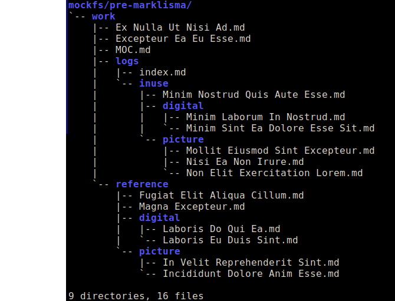
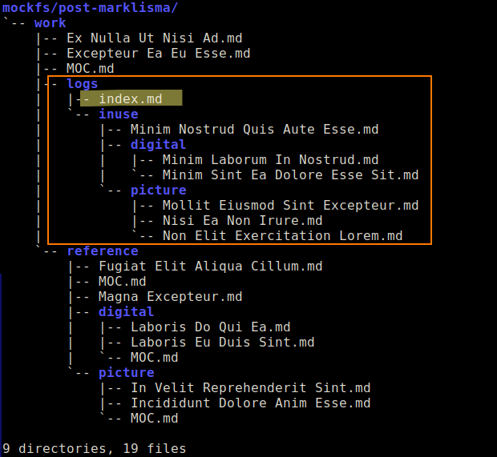
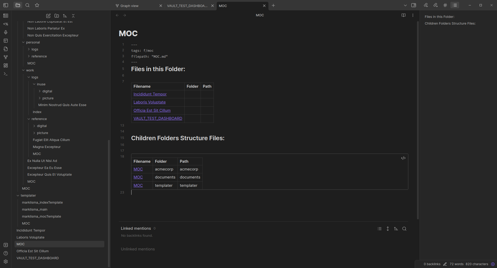
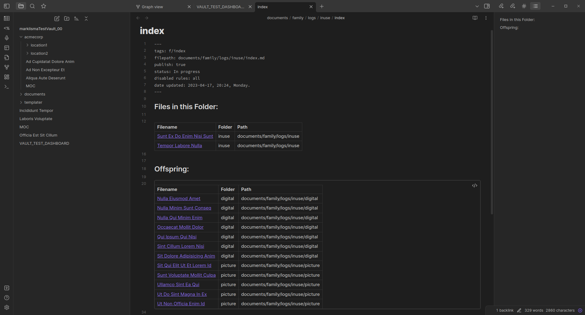
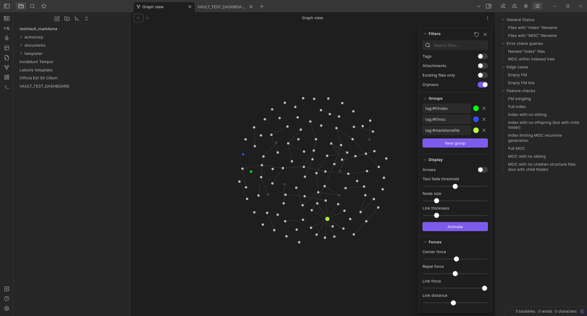
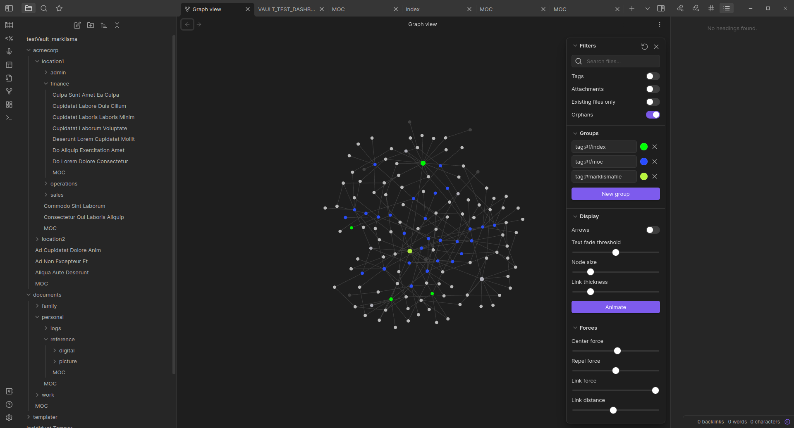

# marklisma

A Markdown Link Structure Maker, to be used with [Obsidian.md](https://obsidian.md/).

# What is marklisma?

Marklisma makes a folder (and it's sub-folders) have a markdown link structure that encompasses every file, while turning the existing folder design in something more meaningful and usable.

While marklisma is currently meant to be used in the Obsidian app (iOS, Android, Mac, Linux, Windows), it's simple concept could be ported to other markdown editors as well.

## What does it do?

Suppose we have this vault pictured below. ("Vault" is just another name for folder, or directory.)

Note: In this example it contains only .md files (which are very similar to .txt files, as I'll explain later), but there would be no problem if files with other extensions were also there. 

After running marklisma we get the vault to be like this below.

As it shows, marklisma created a "MOC.md" file in every folder, except for the folder that previously had an "index.md" file and for it's children folders.

# WARNINGS

- This is experimental code, not thoroughly tested, and it may lead do data leak, damage, or loss.
- I wrote this by myself. I have no professional expertise in software engineering or coding. (Note: "by myself" meaning 1% me and 99% documentation and forums.)

# FAQ

## What are the index and MOC files?

I call the files marklisma handles as "Folder Structure Files", or FOSFI for short. There are two kinds of them: MOC and index files.

MOC ("Map Of Content") files are markdown text files which contains links to other files also in that folder ("sibling files" as I call them) and to FOSFI files of the children folders. MOC screenshot shown below.

Index files are markdown text files which contains links to other files also in that folder ("sibling files" as I call them) and to every file on it's children folders. Index screenshot shown below.

## How will it make my vault look like?

Shown below is a graph of the vault before running marklisma.

Every file is represented as a dot, and every link as a line between the linked files. The folder structure is not taken into account, which makes the graph lack relevant information.

Shown below is a graph of the vault after running marklisma.

## How to use it? Can I use it in any vault?

1) First of all, you would need the Obsidian app, with two plugins enabled: templater and dataview. Make sure dataview has the "DataviewJS queries" toggle enabled as well.
2) Make a backup of your vault before testing it.
3) You most likely need to make a little hack in the Templater `.obsidian/plugins/templater-obsidian/main.js` file: where you read `var DEPTH_LIMIT = 10;` change this variable to a bigger number (for my tests it worked with `var DEPTH_LIMIT = 1000;`, but probably a smaller number would get it working). I think this variable is some kind of Templater's safeguard meant to avoid unwanted recurrent invocations, so here I warn you to think twice before making this hack. However, without this marklisma may fail if it has to make or update more than 9 files. After editing this file, restart Obsidian (if it was running) in order to make it taken into effect.
4) Copy the three files under the src/ folder of this repository into your templater templates folder.
5) Edit (in `marklisma_main.md`) the variables "ixtmt" (index file template path) and "moctmt" (MOC file template path) to suit your use case.
6) Open any markdown file, but preferably not an index or MOC file. (It doesn't matter which file you'll open, as it should be kept untouched by marklisma.)
7) Optional: open the "developer tools" (Ctrl+Shift+I) before running marklisma, in order to keep an eye on errors during it's execution. Also, marklisma will output minor info to the console, while running.
8) Run the command "Open Insert Template modal". Default shortcut for this modal is Alt+E. Select the MAIN (marklisma_main.md) file to run it. 
Note: If you select any of the other files, which are marklisma templates for the index and moc files, Obsidian will simply insert the selected template into the currently open note.
9) Marklisma will have finished execution upon creation of the vault's root MOC.
10) Optional: if you got an error in the console, check if the error-related file was correctly handled. (In my tests which the console warned of errors I most of times got the intended file and content.)

This screen capture video shows marklisma running: [click here to watch.](media/marklisma-run.mkv)

## How to configure and customize it?

1) Where to create the index files.
- By default, if no "index.md" file is previously found within a vault, marklisma will just create a "MOC.md" in every folder.
- Marklisma doesn't create index files, it just updates them.
- Wherever you want to have an index file, just manually create it there; it's content will be updated by marklisma when it runs.
- The folders which holds an "index.md" file, and all of it's children folders, are called "indexed folders"; they won't get MOC files, as the files within them are already linked from the index file.
- Note that note creation from within the Obsidian app will prompt for the note name, and the ".md" extension will be automatically appended to it.

2) Where to create the MOC files.
- Marklisma will create MOC files in every folder that is not indexed.

3) Content of index and MOC files.

- Index files template is: `src/marklisma_indexTemplate.md` .
- MOC files template is: `src/marklisma_mocTemplate.md` .
- Changes in any of them should be taken into effect next time marklisma is run. 
- Before running marklisma, you can test those templates by inserting them or creating a new file with them, the same way any templater template would be tested.

4) Script Logic.

- Most of marklisma logic is at it's main file `src/marklisma_main.md`, which outputs no content to the index or MOC files.

## Any error checks? Can I use it in any vault?

Marklisma tests for two error checks, that if found will prevent marklisma from touching vault's files:

- Are there index files inside an indexed folder? (That is, are there nested indexed folders?)
- Are there MOC files inside an indexed folder?

## What about the YAML FM (frontmatter)?

- If a MOC or index file already has a YAML FM marklisma will try to preserve most of it at the succeeding (updated) file.
	- Many common FM key/values, like tags, aliases and others should be preserved.
- Some keys and values may get removed. 
	- Any FM key that starts with "date" will NOT be preserved at the updated index/MOC file.
	- This is meant to avoid keeping wrong data in some use cases. For example, if you use the linter plugin and it adds to an index/MOC FM some keys like "date created" and "date updated", both would be potentially inaccurate, as they would reflect the filesystem metadata about it; however, marklisma's (index/MOC) file update doesn't just change file's contents, but actually deletes pre-existing file and creates a new one. This happens each time marklisma runs, for every index/MOC file (even when the updated file has the same content as the pre-existing one).
	- For those who want to keep index/MOC FM with creation date, I suggest naming this key differently, maybe like "real date created", or "creation date".
- Some keys and values will be added.
	- A `"date updated"` key, with a corresponding value, will be added. You may want to customize Time/Date formatting (this can be edited in `src/marklisma_main.md`). This key/value will designedly be updated at each marklisma run.
	- A `"disabled rules: all"` key/value will be added. This is meant to avoid Linter plugin from linting index/MOC files.

## How to test marklisma?

Testing marklisma for development purposes is a bit of a headache. As it is not a proper Obsidian plugin, there is no straightforward way to test it immediately as you edit it. So, my method consists of testing the dataview queries dynamically, and testing marklisma itself by running it on a clean test vault. A local git folder can surely help to navigate through test iterations.

Testing marklisma just for watching it working is easier.
- Just "open as a vault" (with the Obsidian app) the folder `tests/testVault_marklisma` of this repository.
- The file "VAULT_TEST_DASHBOARD.md" (on vault's root) has some dataview queries to show what is in the vault, and what should (or shouldn't) change after marklisma has run.
- The folder `errortest/` will prevent marklisma from touching vault's files; if you run marklisma before fixing them (or deleting this folder), the found errors will be shown in the developer console.
- After fixing the errors (or deleting the `errortest/` folder), just run marklisma as explained above.

# Some words about markdown

A Markdown file (.md) is very similar to a plain text file (.txt), and in fact it can be opened as a text file with no data loss while being human readable. They can also be edited by any plain text editor (although a markdown-optimized editor would make it easier to be edited).

They are used (instead of other text formats like .docx or .odt) due to certain advantages like:
- Future-proof, as it doesn't rely on third-party software that may stop being developed. Also allows you to easily change the text editor application.
- Lightweight, can be opened and edited from most low-resources devices, like home routers or decades-old desktops.
- Very low storage space usage.
- Seamlessly handled by all kinds of applications.
- Privacy: no hidden metadata are stored in the files.
- Appearance features, like text formatting, media attachment, tables.
- Informational features, like links between files and YAML frontmatter.

More about markdown:
- https://en.wikipedia.org/wiki/Markdown .
- [markdownguide.org](https://www.markdownguide.org/)

# TODO
- Pull requests and issues are very welcome.
- Fix some occasionally flagged (on console.log) errors:
	- A promise-related error on some file creation/update.
	- Another error related to absence of obsidian metadata error on some files (mostly when the file was created from outside of obsidian app).
	- Note: most of time those errors happened to me, the I got the index/MOC files as intended.
- Fix the need for the timeouts in the main marklisma file.
	- Without them, the dataview query from a file could get into another file. I tried to fix it by using async/await for the queries, but this was throwing an error; maybe later I will try this again.
- Ask/wait for templater's API.

# Roadmap
- Maybe consider branching marklisma to a standalone Obsidian plugin (which would mean not relying on Templater, but only on Dataview). This could also make development testing much easier.

# Acknowledgments
- Obsidian founders and Obsidian development team, for this amazing piece of software.
- Obsidian community, for so many enthusiastic contributions.
- The writers of those great pages/websites I used while developing marklisma:
	- https://liamca.in/hello
	- https://marcus.se.net/obsidian-plugin-docs/ (note: a few days ago the official obsidian plugin docs was published as well.)
	- https://shbgm.ca/blog/obsidian/how-to-use-templater-js-scripts
	- Dataview plugin: https://blacksmithgu.github.io/obsidian-dataview/)
	- Templater plugin: https://silentvoid13.github.io/Templater/